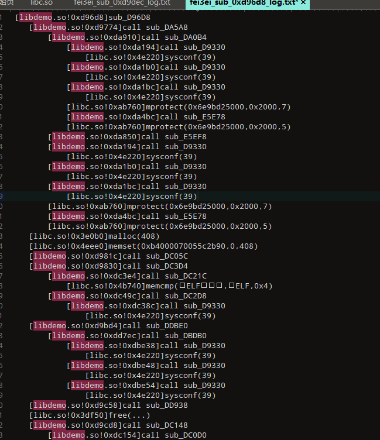

自用的trace工具，受棕熊项目的启发：https://github.com/jiqiu2022/vm-trace-release

能够trace到syscall libc函数。



# *dependencies* 

1. fmt:https://fmt.dev/12.0/
2. lief:https://lief.re/
3. qbdi:https://qbdi.quarkslab.com/

# usage

将libfmt.a libLIEF.a libQBDI.a放在libs目录下，然后编译，将编译产物放在手机的/data/local/tmp下，使用setenforce 0更改策略。使用脚本为trace.js，将下面的位置填好即可，然后使用frida注入。

```js
var traceSoname = //TODO;
var subFunctionoffset = //TODO;
var packageName = //TODO;
```